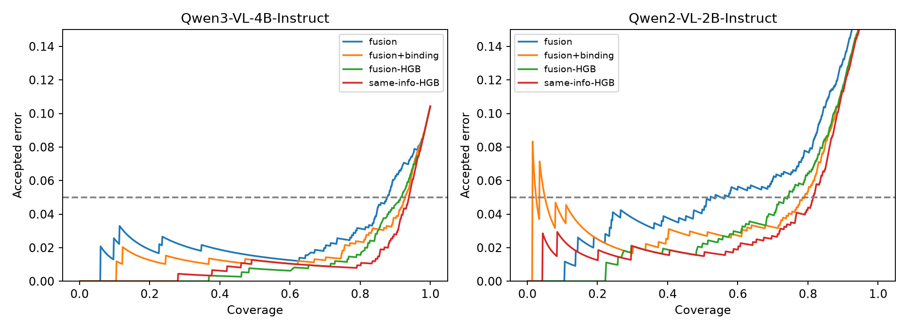

# Kết quả pilot v2 — 28/09/2026

Đã huấn luyện correctness heads mới trên đầu ra extractor có sẵn. Nguồn: [CORD-v2](https://huggingface.co/datasets/naver-clova-ix/cord-v2), 800 train / 100 validation / 100 test, 8 field tiền. Đây là lượt phân tích thăm dò; test đã được dùng trong pilot cũ.

Coverage là tỷ lệ quyết định được tự động chấp nhận. Risk là tỷ lệ sai trong phần được chấp nhận. Threshold được chọn trên validation với target 5%; risk test có thể vượt 5%. AURC thấp hơn là tốt hơn. Không có risk certification.

## Qwen3-VL-4B-Instruct

Số quyết định train/validation/test: [6375, 799, 796]. Tỷ lệ sai accept-all trên test: 10.43%.

| Head | AURC ↓ | Brier ↓ | Coverage @ target 5% | Risk test | Lỗi / accepted |
|---|---:|---:|---:|---:|---:|
| field-only | 0.0635 | 0.0853 | 62.56% | 6.02% | 30 / 498 |
| fusion | 0.0265 | 0.0629 | 86.06% | 4.67% | 32 / 685 |
| fusion+binding | 0.0190 | 0.0501 | 92.46% | 4.76% | 35 / 736 |
| same-info-HGB | 0.0123 | 0.0351 | 93.59% | 4.70% | 35 / 745 |
| fusion-HGB | 0.0133 | 0.0512 | 94.10% | 6.14% | 46 / 749 |
| no-field | 0.0187 | 0.0588 | 88.07% | 4.28% | 30 / 701 |
| no-key-competition | 0.0188 | 0.0511 | 92.09% | 4.77% | 35 / 733 |
| no-value-rival | 0.0190 | 0.0512 | 92.46% | 4.89% | 36 / 736 |

### Bất định của so sánh

Bootstrap ghép cặp 1000 lần theo tài liệu, resample cả validation/test rồi chọn lại threshold. Head giữ nguyên; CI chưa tính bất định do fitting train hay template clustering.

| So sánh (A − B) | Chênh coverage quan sát (điểm %) | 95% CI coverage | 95% CI AURC |
|---|---:|---:|---:|
| fusion+binding minus fusion | +6.41 | [+1.76, +9.17] | [-0.0172, -0.0008] |
| same-info-HGB minus fusion+binding | +1.13 | [-0.63, +3.27] | [-0.0118, -0.0026] |
| same-info-HGB minus fusion-HGB | -0.50 | [-2.26, +5.03] | [-0.0037, +0.0023] |
| fusion+binding minus no-key-competition | +0.38 | [-0.63, +1.00] | [-0.0011, +0.0016] |

Trong bootstrap có tập accept không rỗng, risk vượt target 5%: fusion+binding 38.6%, fusion 48.6%. Đây là thống kê mô tả.

### Taxonomy tự động

| Loại lỗi | Tất cả split | Test |
|---|---:|---:|
| miss | 96 | 8 |
| binding_absent | 482 | 51 |
| binding | 62 | 6 |
| transcription | 98 | 14 |
| absent_halluc | 35 | 4 |

### Sensitivity: bỏ subtotal ABSENT nhưng prediction = gold total

Bỏ 31 quyết định validation và 29 test. Không fit lại head; chọn lại threshold trên phần validation còn lại. Đây là diagnostic dùng gold, không triển khai được như quy tắc selection.

| Head | Coverage | Risk |
|---|---:|---:|
| fusion | 98.31% | 5.57% |
| fusion+binding | 98.57% | 5.82% |
| fusion-HGB | 97.78% | 5.07% |
| same-info-HGB | 97.91% | 5.19% |

## Qwen2-VL-2B-Instruct

Số quyết định train/validation/test: [6375, 799, 796]. Tỷ lệ sai accept-all trên test: 19.60%.

| Head | AURC ↓ | Brier ↓ | Coverage @ target 5% | Risk test | Lỗi / accepted |
|---|---:|---:|---:|---:|---:|
| field-only | 0.1277 | 0.1456 | 12.56% | 10.00% | 10 / 100 |
| fusion | 0.0566 | 0.0989 | 70.35% | 6.25% | 35 / 560 |
| fusion+binding | 0.0483 | 0.0692 | 77.76% | 4.85% | 30 / 619 |
| same-info-HGB | 0.0384 | 0.0560 | 81.41% | 4.94% | 32 / 648 |
| fusion-HGB | 0.0403 | 0.0759 | 77.64% | 5.83% | 36 / 618 |
| no-field | 0.0529 | 0.0755 | 72.49% | 4.33% | 25 / 577 |
| no-key-competition | 0.0553 | 0.0773 | 75.38% | 4.67% | 28 / 600 |
| no-value-rival | 0.0437 | 0.0699 | 79.27% | 5.39% | 34 / 631 |

### Bất định của so sánh

Bootstrap ghép cặp 1000 lần theo tài liệu, resample cả validation/test rồi chọn lại threshold. Head giữ nguyên; CI chưa tính bất định do fitting train hay template clustering.

| So sánh (A − B) | Chênh coverage quan sát (điểm %) | 95% CI coverage | 95% CI AURC |
|---|---:|---:|---:|
| fusion+binding minus fusion | +7.41 | [-0.50, +47.04] | [-0.0171, +0.0008] |
| same-info-HGB minus fusion+binding | +3.64 | [-0.50, +9.79] | [-0.0192, -0.0019] |
| same-info-HGB minus fusion-HGB | +3.77 | [-1.00, +13.90] | [-0.0077, +0.0044] |
| fusion+binding minus no-key-competition | +2.39 | [-0.25, +26.98] | [-0.0145, -0.0012] |

Trong bootstrap có tập accept không rỗng, risk vượt target 5%: fusion+binding 47.2%, fusion 75.3%. Đây là thống kê mô tả.

### Taxonomy tự động

| Loại lỗi | Tất cả split | Test |
|---|---:|---:|
| binding | 402 | 39 |
| binding_absent | 812 | 82 |
| absent_halluc | 49 | 2 |
| miss | 297 | 26 |
| transcription | 121 | 7 |

### Sensitivity: bỏ subtotal ABSENT nhưng prediction = gold total

Bỏ 28 quyết định validation và 26 test. Không fit lại head; chọn lại threshold trên phần validation còn lại. Đây là diagnostic dùng gold, không triển khai được như quy tắc selection.

| Head | Coverage | Risk |
|---|---:|---:|
| fusion | 72.34% | 5.75% |
| fusion+binding | 84.03% | 5.41% |
| fusion-HGB | 80.13% | 5.19% |
| same-info-HGB | 84.42% | 4.92% |

## Giới hạn

- LR fusion+binding và generic HGB có cùng feature matrix, nhãn train và candidate information. Thí nghiệm này đo ích lợi tín hiệu binding và baseline correctness, chưa kiểm chứng architecture binding mới.
- OCR/candidate dùng annotation CORD. Chưa chạy OCR thật hoặc unseen-template split; chưa có nguồn thứ hai.
- Không fine-tune VLM; binding scores cũ cần nhiều teacher-forcing pass. Chưa đáp ứng head một lượt.
- Normalization kế thừa coi 0 như ABSENT và bỏ dấu âm. Taxonomy tự động chưa được hai người audit.
- Sample audit ngẫu nhiên và sample lỗi bổ sung được đánh dấu riêng trong CSV; không trộn để ước lượng prevalence.

Số liệu đầy đủ và endpoint secondary 1%, 2%, 10%: [metrics.json](../results/metrics.json). Mẫu audit: [audit.csv](../results/audit.csv). Protocol: [pilot-protocol.md](pilot-protocol.md).
