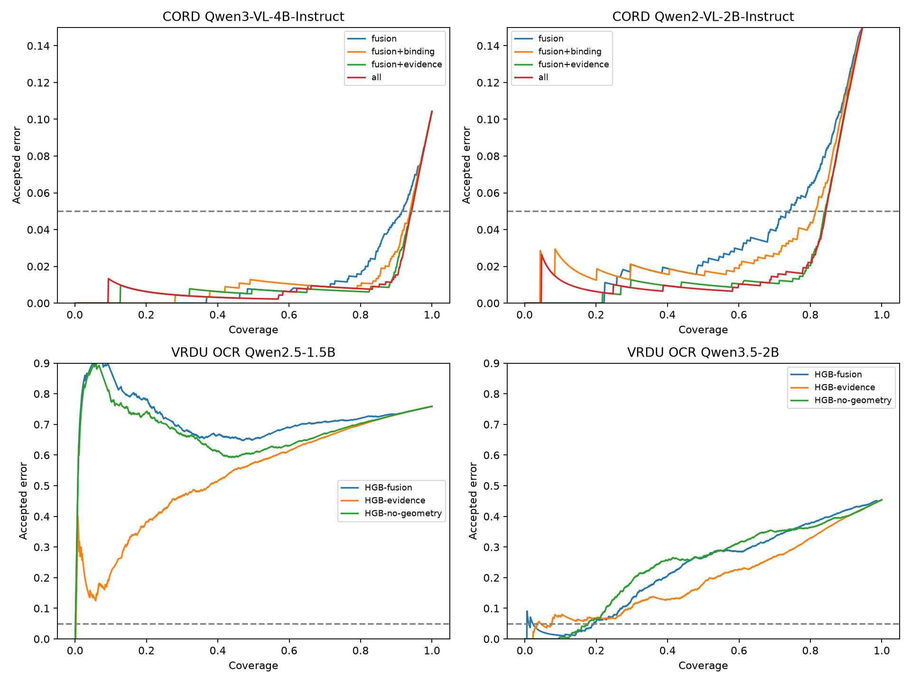

# Stage 2 — kết quả thực nghiệm

Ngày 28/09/2026. Tham khảo [protocol](stage2-protocol.md). CORD vẫn là exploratory; VRDU dùng split chính thức unseen-template, extractor mới trên OCR thật. Tất cả confidence heads HGB so sánh có hyperparameters giống nhau.

## CORD: Qwen3-VL-4B-Instruct

| HGB features | AURC ↓ | Mean AURC 5-fold document CV ↓ | Coverage @ target 5% | Risk test |
|---|---:|---:|---:|---:|
| fusion | 0.01333 | 0.01403 | 94.10% | 6.14% |
| fusion+binding | 0.01229 | 0.00944 | 93.59% | 4.70% |
| fusion+evidence | 0.01119 | 0.00818 | 94.72% | 5.44% |
| all | 0.01086 | 0.00778 | 94.22% | 4.93% |
| evidence-no-geometry | 0.00903 | 0.00987 | 93.72% | 4.69% |

| Contrast | 95% CI ΔAURC | 95% CI Δcoverage (điểm %) |
|---|---:|---:|
| fusion+evidence minus fusion | [-0.00541, +0.00224] | [-1.26, +6.18] |
| all minus fusion+binding | [-0.00490, +0.00231] | [-1.01, +2.38] |
| all minus fusion+evidence | [-0.00174, +0.00093] | [-1.63, +0.88] |
| fusion+evidence minus evidence-no-geometry | [-0.00066, +0.00647] | [-1.13, +2.02] |

## CORD: Qwen2-VL-2B-Instruct

| HGB features | AURC ↓ | Mean AURC 5-fold document CV ↓ | Coverage @ target 5% | Risk test |
|---|---:|---:|---:|---:|
| fusion | 0.04030 | 0.04834 | 77.64% | 5.83% |
| fusion+binding | 0.03844 | 0.04128 | 81.41% | 4.94% |
| fusion+evidence | 0.02746 | 0.03253 | 84.30% | 5.22% |
| all | 0.02900 | 0.03261 | 84.17% | 4.78% |
| evidence-no-geometry | 0.03212 | 0.03768 | 82.54% | 5.94% |

| Contrast | 95% CI ΔAURC | 95% CI Δcoverage (điểm %) |
|---|---:|---:|
| fusion+evidence minus fusion | [-0.01894, -0.00774] | [+2.00, +19.79] |
| all minus fusion+binding | [-0.01673, -0.00349] | [+0.13, +6.41] |
| all minus fusion+evidence | [-0.00166, +0.00608] | [-2.64, +1.26] |
| fusion+evidence minus evidence-no-geometry | [-0.00952, -0.00086] | [-1.00, +6.41] |

## VRDU: Qwen2.5-1.5B

Documents: {'train': 200, 'test': 300, 'development': 50, 'calibration': 50}. Decisions: {'train': 1200, 'development': 300, 'calibration': 300, 'test': 1800}. Excluded multi-value: {}.
Accept-all error test: 75.89%. Input truncated: 0; output capped: 1.

| Head | AURC ↓ | Brier ↓ | Coverage @ target 5% | Risk test | Errors / accepted |
|---|---:|---:|---:|---:|---:|
| LR-fusion | 0.74792 | 0.32238 | 0.17% | 66.67% | 2 / 3 |
| HGB-fusion | 0.72344 | 0.28214 | 0.72% | 46.15% | 6 / 13 |
| HGB-evidence | 0.53484 | 0.15803 | 3.67% | 15.15% | 10 / 66 |
| HGB-no-geometry | 0.69068 | 0.26563 | 0.78% | 50.00% | 7 / 14 |

| Contrast | 95% CI ΔAURC | 95% CI Δcoverage (điểm %) |
|---|---:|---:|
| HGB-evidence minus HGB-fusion | [-0.20728, -0.17114] | [+2.11, +8.56] |
| HGB-evidence minus HGB-no-geometry | [-0.17318, -0.14010] | [+2.11, +8.56] |

### Calibration domain: cùng head fit150 docs

| Head | Source-template calibration: coverage / risk | Target-template calibration: coverage / risk |
|---|---:|---:|
| HGB-fusion | 32.11% / 66.26% | 0.78% / 50.00% |
| HGB-evidence | 34.06% / 41.76% | 4.33% / 19.23% |

Primary thresholds dùng 50 nhãn calibration từ template Short-Form mới; không phải zero-shot threshold transfer. Secondary source/target calibration giữ cùng score/head, dùng 50 docs mỗi bên.

## VRDU: Qwen3.5-2B

Documents: {'train': 200, 'test': 300, 'development': 50, 'calibration': 50}. Decisions: {'train': 1200, 'development': 300, 'calibration': 300, 'test': 1800}. Excluded multi-value: {}.
Accept-all error test: 45.39%. Input truncated: 0; output capped: 0.

| Head | AURC ↓ | Brier ↓ | Coverage @ target 5% | Risk test | Errors / accepted |
|---|---:|---:|---:|---:|---:|
| LR-fusion | 0.40035 | 0.26642 | 1.11% | 30.00% | 6 / 20 |
| HGB-fusion | 0.23349 | 0.20910 | 14.06% | 1.19% | 3 / 253 |
| HGB-evidence | 0.19919 | 0.14858 | 2.89% | 3.85% | 2 / 52 |
| HGB-no-geometry | 0.24430 | 0.21848 | 14.22% | 2.34% | 6 / 256 |

| Contrast | 95% CI ΔAURC | 95% CI Δcoverage (điểm %) |
|---|---:|---:|
| HGB-evidence minus HGB-fusion | [-0.04412, -0.02390] | [-15.78, +26.06] |
| HGB-evidence minus HGB-no-geometry | [-0.05464, -0.03406] | [-15.39, +15.11] |

### Calibration domain: cùng head fit150 docs

| Head | Source-template calibration: coverage / risk | Target-template calibration: coverage / risk |
|---|---:|---:|
| HGB-fusion | 42.72% / 23.80% | 18.83% / 3.54% |
| HGB-evidence | 36.33% / 12.69% | 0.00% / — |

Primary thresholds dùng 50 nhãn calibration từ template Short-Form mới; không phải zero-shot threshold transfer. Secondary source/target calibration giữ cùng score/head, dùng 50 docs mỗi bên.

## Diễn giải và giới hạn

Evidence features thắng HGB mạnh về ranking trên Qwen2 CORD và cả hai model VRDU. Trên Qwen3 CORD gain nhỏ, CI chứa 0. Tại endpoint 5% VRDU, ranking gain không chuyển thành coverage gain ổn định; risk thực tế và coverage phải được đọc cùng nhau.

NameMatch gốc giữ punctuation/case. [Sensitivity](../results/stage2/label-sensitivity.json) không refit head hoặc threshold: Qwen3.5 HGB-evidence có 2/52 lỗi official, cả hai là dấu chấm cuối tên; dưới quy tắc normalized secondary còn 0/52. Không coi 0/52 là risk guarantee và không thay primary result.

Corpus CORD dùng annotation OCR; VRDU dùng OCR cung cấp trong benchmark. Các features là rules schema-specific từ text/boxes, không phải architecture mới hay visual encoder đã học. Classifier có field identity; chưa chứng minh schema-agnostic generalization.

Bootstrap 1000 lần theo document, resample calibration/test và chọn lại threshold. Head cố định, không tính fit variance hoặc dependence giữa cùng registrant. Development VRDU50 không dùng fit/tune confidence head; 2 mẫu được dùng phát triển schema của stage 3.

Prior: [ExtractConf](https://arxiv.org/abs/2606.24420), [PLV](https://arxiv.org/abs/2609.20110), [Valid selective risk control](https://arxiv.org/abs/2608.14639). Kết quả hiện chưa vượt các prior này trong matched reproduction; không claim novelty chỉ từ feature fusion.
