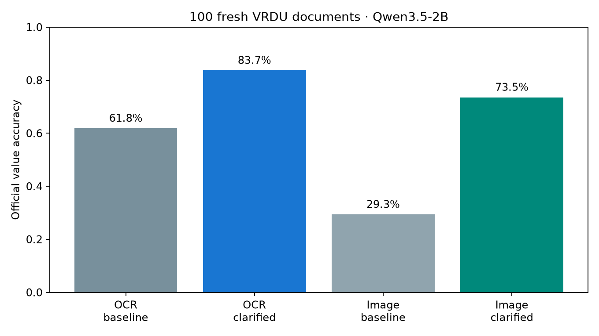

# Stage 3 — xác nhận trên 100 tài liệu mới

Qwen3.5-2B, bốn điều kiện ảnh/OCR × schema ngắn/làm rõ vai trò, 600 quyết định mỗi điều kiện. 100 Short Form không nằm trong 600 tài liệu stage 2; chọn bằng hash filename trước inference. Không fit/tune trên holdout mới. [Protocol](stage3-protocol.md).

| Đầu vào / schema | Accuracy official | Accuracy normalized (secondary) | Field present accuracy | Field ABSENT accuracy |
|---|---:|---:|---:|---:|
| ocr-baseline | 61.83% | 62.33% | 68.47% | 42.95% |
| ocr-clarified | 83.67% | 84.17% | 84.01% | 82.69% |
| image-baseline | 29.33% | 30.50% | 30.86% | 25.00% |
| image-clarified | 73.50% | 74.33% | 77.03% | 63.46% |

## Paired document bootstrap, 2000 lần

| Contrast | Δ accuracy official (điểm %) | 95% CI |
|---|---:|---:|
| image-baseline minus ocr-baseline | -32.50 | [-37.00, -27.83] |
| image-clarified minus ocr-clarified | -10.17 | [-12.83, -7.50] |
| ocr-clarified minus ocr-baseline | +21.83 | [+18.33, +25.33] |
| image-clarified minus image-baseline | +44.17 | [+40.33, +48.00] |

## Confidence cao và transfer head đã học

Confidence cao = mean token probability >99%; không coi logprob là xác suất correctness. Head và ngưỡng bên dưới giữ nguyên từ stage 2: không calibration lại trên holdout.

| Điều kiện | Lỗi / quyết định confidence cao | HGB-fusion coverage / official risk | HGB-evidence coverage / official risk |
|---|---:|---:|---:|
| ocr-baseline | 18 / 97 | 16.17% / 2.06% (2/97) | 3.67% / 4.55% (1/22) |
| ocr-clarified | 21 / 157 | 20.83% / 1.60% (2/125) | 3.33% / 0.00% (0/20) |
| image-baseline | 34 / 71 | 3.83% / 78.26% (18/23) | 0.00% / — (0/0) |
| image-clarified | 3 / 153 | 19.17% / 0.00% (0/115) | 0.00% / — (0/0) |

HGB-evidence reject toàn bộ hai điều kiện ảnh ở threshold cũ: an toàn bằng zero coverage chưa giải quyết automation. HGB-fusion trên image-baseline chấp nhận 23 quyết định và sai18, còn image-clarified chấp nhận115 và sai0. Không diễn giải 0/115 thành risk guarantee; thay schema đã thay accuracy gốc và phân phối score.

Trong image-clarified, 3 high-confidence errors đều là foreign_principle_name: 2 prediction bỏ qualifier trong ngoặc, 1 prediction điền vào field gold ABSENT. Không đủ cơ sở gọi cả3 là lỗi binding thật; cần audit về completeness và missing annotations.

## Per-field official accuracy

| Field | OCR baseline | OCR clarified | Image baseline | Image clarified |
|---|---:|---:|---:|---:|
| registration_num | 90.0% | 91.0% | 3.0% | 94.0% |
| registrant_name | 52.0% | 91.0% | 6.0% | 67.0% |
| foreign_principle_name | 54.0% | 58.0% | 42.0% | 53.0% |
| file_date | 59.0% | 84.0% | 36.0% | 79.0% |
| signer_name | 61.0% | 78.0% | 50.0% | 52.0% |
| signer_title | 55.0% | 100.0% | 39.0% | 96.0% |

## Chi phí đo trên A30

| Điều kiện | Generate seconds / doc (batch amortized) | CPU evidence seconds / doc | Peak allocated GiB |
|---|---:|---:|---:|
| ocr-baseline | 0.708 | 0.0125 | 6.82 |
| ocr-clarified | 0.682 | 0.0123 | 6.96 |
| image-baseline | 1.604 | 0.0127 | 6.80 |
| image-clarified | 1.551 | 0.0124 | 6.80 |

Generation time không gồm loading model, tải/render PDF, processor và ghi output. Feature time chỉ gồm xử lý OCR/boxes, không gồm chạy OCR. Không có input truncation hay output cap ở bốn điều kiện.

## Giới hạn diễn giải

- Schema làm rõ chứa thêm thông tin và nhiều token hơn. Gain là extraction gain do thay cách mô tả target, chưa phải novelty hay architecture superiority. Cần length-matched control và paraphrase controls.
- Image model 2B, ảnh mọi page cạnh dài1280px; OCR cung cấp sẵn có thể được tạo ở độ phân giải khác. Kết quả không chứng minh OCR luôn hơn VLM hoặc cô lập riêng ảnh hưởng layout.
- Giá trị nằm trên trang nhưng sai official matcher còn có thể do partial value, punctuation hoặc schema ambiguity. Nhãn tự động không thay audit người.
- Document holdout chưa loại dependence theo registrant/person. Source vẫn là VRDU, không phải dataset thứ ba.
- Hai head transfer đã fit trên OCR baseline, vì vậy thất bại trên ảnh/schema mới là domain shift diagnostic, không phải so sánh optimal heads huấn luyện cùng modality.

## Artifact audit

[Viewer 100 tài liệu và bốn prediction](../results/stage3/audit-viewer.html), [2400 quyết định audit](../results/stage3/audit.csv), [metrics.json](../results/stage3/metrics.json), [manifest holdout](../results/stage3/holdout-manifest.json). Các cột human còn trống.

