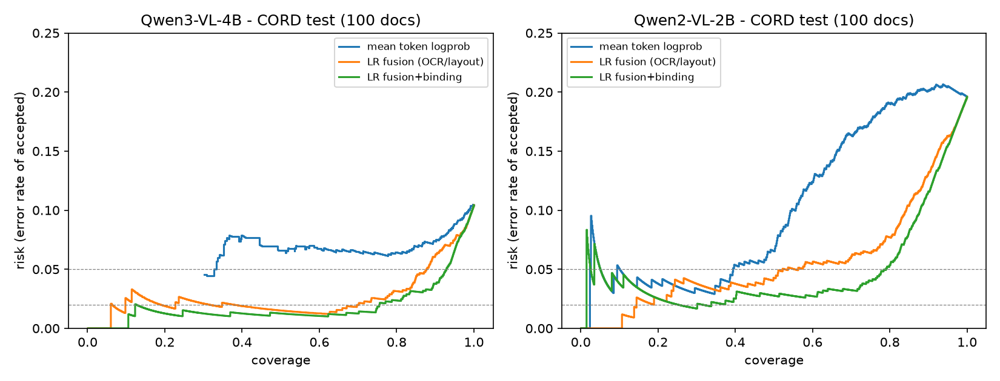

# Báo cáo pilot E0/E1: Binding-aware selective KIE trên CORD-v2

**Ngày:** 28/09/2026  
**Liên quan:** [Đề cương CVPR 2027](binding-aware-selective-kie-cvpr2027.md), mục 5 (H1–H4), mục 8 (E0, E1), mục 11 (mốc 04/10 và 11/10)  
**Trạng thái:** Pilot, extractor giữ nguyên (không fine-tune). Một nguồn dữ liệu. Nhãn lỗi sinh tự động, chưa có người audit.

## 1. Tóm tắt

- **H1 được ủng hộ trên CORD.** Lỗi binding chiếm 70–72% tổng số lỗi trên cả hai extractor. Gần như mọi lỗi binding đều qua được kiểm tra "giá trị có xuất hiện trên trang". Với Qwen3-VL-4B, 475/622 lỗi mà model tự tin >99% là lỗi binding, và logprob của token gần như bằng 0 kể cả khi sai.
- **E0 qua gate.** Nếu bắt hoàn hảo lỗi binding, coverage tăng so với baseline mạnh nhất:
  - Qwen3-VL-4B: +6.7 điểm % tại risk 5%.
  - Qwen2-VL-2B: +28.4 điểm % tại risk 5%.
  - Cả hai đều vượt ngưỡng ≥5 điểm % của đề cương.
- **H2 và H3 được ủng hộ một phần.** Thêm đặc trưng cạnh tranh binding vào selector fusion (OCR/layout) làm tăng coverage tại risk 5% trên test, với ngưỡng chọn từ validation:
  - Qwen3-VL-4B: +6.4 điểm %.
  - Qwen2-VL-2B: +7.4 điểm %.
- **Lợi ích chưa vững.**
  - Với Qwen3-VL-4B, gần như toàn bộ lợi ích đến từ một nhóm mơ hồ: hóa đơn không in subtotal và model chép total vào. Bỏ nhóm này ra thì chênh lệch không còn ý nghĩa thống kê.
  - Với Qwen2-VL-2B, lợi ích vẫn còn sau khi bỏ nhóm này. Nhưng khi tính cả độ bất định lúc chọn ngưỡng thì CI rất rộng.
  - Ở risk 2%, không phương pháp nào giữ được risk thực tế dưới mục tiêu một cách ổn định.
- **Rủi ro lớn nhất cho câu chuyện của paper.** Lỗi hoán đổi thật (cả hai trường đều in trên trang, ví dụ tax↔service, cash↔total) nhiều ở model yếu (402 lỗi) nhưng hiếm ở model mạnh (62 lỗi). Failure mode này có thể thu hẹp khi extractor mạnh lên.

**Kết luận go/no-go (mốc 11/10):** đi tiếp, có điều kiện. Chưa đủ cho claim CVPR. Cần kiểm lại trên extractor mạnh hơn, trên dữ liệu có split theo template chưa thấy với OCR thật, và sau khi đã tách riêng nhóm mơ hồ (mục 8).

## 2. Thiết lập

| Thành phần | Lựa chọn |
| --- | --- |
| Dữ liệu | CORD-v2 (hóa đơn Indonesia). 800 train / 100 validation / 100 test theo split gốc. |
| Schema chính | 8 trường tiền, mỗi trường một giá trị hoặc ABSENT: `subtotal, tax, service, discount, total, cash, change, card`. |
| Loại khỏi phân tích | `qty` (tổng số lượng): model *đếm* chứ không *đọc* từ trang, tỉ lệ lỗi 47–68%. Các trường có gold nhiều giá trị (dạng list) cũng bị loại. |
| Số quyết định | train 6375 / validation 799 / test 796 (tài liệu × trường). |
| Extractor (giữ nguyên) | Qwen3-VL-4B-Instruct và Qwen2-VL-2B-Instruct, zero-shot. Prompt yêu cầu trả JSON, decode greedy, ảnh có cạnh dài ≤1280 px. |
| Candidate | Mọi chuỗi số trong text OCR (lấy từ từ OCR có sẵn của CORD, không dùng category), cộng thêm ABSENT. Trung bình 7–7.5 giá trị trên mỗi tài liệu. Candidate recall là 99.3–99.5%. |
| Chuẩn hóa | Parse số theo quy tắc: 3 chữ số sau dấu phân cách là phần nghìn, còn lại là phần thập phân. Bỏ dấu âm. Giá trị `0` được coi là ABSENT. |

### Taxonomy lỗi (tự động, dựa trên category của CORD)

| Nhãn | Định nghĩa |
| --- | --- |
| `binding` | Gold có giá trị. Model dự đoán sai, và giá trị dự đoán có trên trang nhưng thuộc category khác. |
| `binding_absent` | Gold là ABSENT. Model điền một giá trị có trên trang nhưng thuộc category khác. |
| `transcription` | Gold có giá trị. Giá trị dự đoán không có trên trang (thường là sai chữ số). |
| `absent_halluc` | Gold là ABSENT. Giá trị dự đoán không có trên trang. |
| `miss` | Gold có giá trị, model trả null. |

### Các score so sánh (E1)

| Score | Đặc trưng |
| --- | --- |
| `lp_mean`, `lp_min` | Logprob của các token giá trị trong lượt trích JSON. |
| LR extractor-only | Logistic regression trên logprob (mean/min/first), số token, is_null, one-hot trường. Tương ứng một correctness head tổng quát. |
| LR fusion (OCR/layout) | Như trên, thêm: giá trị có trên trang không, số lần xuất hiện, số candidate cùng kiểu. Đây là **baseline mạnh nhất**. |
| `bind_lp` (không cần train) | Xác suất của giá trị dự đoán trong phân phối teacher-forcing trên (các candidate + ABSENT) của trường đó. |
| LR binding-only | `bind_lp`, margin với đối thủ mạnh nhất, argmax, entropy, logprob của null, và `key_lp`. |
| **LR fusion+binding** | Fusion cộng các đặc trưng binding. **Phương pháp đề xuất trong pilot.** |

`key_lp` đo cạnh tranh *phía trường*: với giá trị v, lấy softmax trên các trường của điểm chuẩn hóa mà mỗi trường gán cho v. Nó trả lời câu hỏi: trường này có đang tranh giá trị v với trường khác không?

**Tín hiệu binding được tính thế nào.** Với mỗi (tài liệu, trường, candidate), tính log P(candidate + `<|im_end|>` | ảnh, câu hỏi về trường) bằng teacher-forcing trên cùng extractor. Tín hiệu này không cần train. Nó khác với binding head được train chung như mô tả ở mục 6 của đề cương.

**Giao thức.** Selector fit trên train. Ngưỡng là mức thấp nhất đạt risk ≤ mục tiêu trên validation. Coverage và risk báo cáo trên test. So sánh chính là fusion+binding với fusion, bootstrap ghép cặp theo tài liệu (B=2000).

## 3. E0: Tần suất lỗi và trần lợi ích

### 3.1. Phân bố lỗi (cả 1000 tài liệu, 8 trường chính)

| | Qwen3-VL-4B | Qwen2-VL-2B |
| --- | --- | --- |
| Tỉ lệ lỗi | 9.7% (773 / 7970) | 21.1% (1681 / 7970) |
| `binding_absent` | 482 | 812 |
| `binding` | 62 | 402 |
| **Tổng binding** | **544 (70%)** | **1214 (72%)** |
| `transcription` | 98 | 121 |
| `miss` | 96 | 297 |
| `absent_halluc` | 35 | 49 |
| Lỗi có mean token prob > 0.99 | 622, trong đó 475 là binding | 50, trong đó 32 là binding |
| Lỗi binding qua kiểm tra "có trên trang" | 544 / 544 | 1212 / 1214 |

**Lỗi tập trung ở vài trường.**

- *Qwen3-VL-4B:*
  - `subtotal`: 312 lỗi `binding_absent`, đa số là chép total khi hóa đơn không in subtotal.
  - `discount`: 73 lỗi `binding_absent`.
  - `service`: 33 lỗi `binding_absent`.
  - `tax`: 29 lỗi `binding`, chủ yếu là hoán đổi tax↔service.
- *Qwen2-VL-2B:*
  - `tax`: 178 lỗi `binding`.
  - `cash`: 83 lỗi `binding`, là cash↔total.
  - `service`: 234 lỗi `binding_absent`.
  - `subtotal`: 320 lỗi `binding_absent`.
  - Chi tiết từng trường ở [results/supplement.txt](../results/supplement.txt).

### 3.2. Trần lợi ích bằng oracle (test, dựa trên ranking của LR fusion)

Oracle đẩy mọi lỗi binding xuống cuối ranking và giữ nguyên thứ tự còn lại. Bảng ghi mức tăng coverage so với ranking gốc, tính trên đường risk–coverage của chính tập test. Oracle không phải phương pháp triển khai được.

| Oracle trên | Qwen3-VL-4B @10% / @5% / @2% | Qwen2-VL-2B @10% / @5% / @2% |
| --- | --- | --- |
| Mọi lỗi binding | +0.0 / **+6.7** / +21.2 | +5.2 / **+28.4** / +0.0 |
| Chỉ `binding` | +0.0 / +0.8 / +2.9 | +2.9 / +12.4 / +0.0 |
| Chỉ `transcription` | 0 / 0 / 0 | 0 / 0 / 0 |
| Chỉ `miss` | 0 / +1.0 / +10.3 | +2.9 / +22.7 / +47.9 |

Gate của E0 (≥5 điểm % tại mức risk mục tiêu) **qua ở risk 5% trên cả hai model**. Riêng Qwen3-VL-4B, phần lớn trần lợi ích đến từ `binding_absent`, không phải từ hoán đổi thật.

## 4. E1/H2: Kết quả chính trên test

Ô ghi: coverage / risk thực tế trên test, với ngưỡng chọn trên validation.

### Qwen3-VL-4B

| Score | AURC | @10% | @5% | @2% |
| --- | --- | --- | --- | --- |
| lp_mean | 0.0624 | 0.991 / 0.104 | 0.000 / – | 0.000 / – |
| lp_min | 0.0575 | 0.997 / 0.105 | 0.000 / – | 0.000 / – |
| bind_lp (không train) | 0.0648 | 1.000 / 0.104 | 0.293 / 0.039 | 0.019 / 0.000 |
| LR extractor-only | 0.0299 | 1.000 / 0.104 | 0.861 / 0.057 | 0.597 / 0.017 |
| LR fusion (baseline) | 0.0265 | 1.000 / 0.104 | 0.861 / 0.047 | 0.761 / 0.025 |
| LR binding-only | 0.0266 | 0.996 / 0.101 | 0.887 / 0.042 | 0.711 / 0.027 |
| **LR fusion+binding** | **0.0190** | 1.000 / 0.104 | **0.925 / 0.048** | 0.768 / 0.021 |

### Qwen2-VL-2B

| Score | AURC | @10% | @5% | @2% |
| --- | --- | --- | --- | --- |
| lp_mean | 0.1027 | 0.500 / 0.065 | 0.421 / 0.054 | 0.322 / 0.031 |
| lp_min | 0.0805 | 0.618 / 0.083 | 0.513 / 0.056 | 0.320 / 0.031 |
| bind_lp (không train) | 0.1225 | 0.241 / 0.130 | 0.107 / 0.071 | 0.046 / 0.000 |
| LR extractor-only | 0.0568 | 0.832 / 0.095 | 0.727 / 0.059 | 0.141 / 0.018 |
| LR fusion (baseline) | 0.0566 | 0.833 / 0.095 | 0.704 / 0.062 | 0.153 / 0.025 |
| LR binding-only | 0.0550 | 0.863 / 0.092 | 0.768 / 0.049 | 0.467 / 0.038 |
| **LR fusion+binding** | **0.0483** | **0.872 / 0.095** | **0.778 / 0.048** | 0.399 / 0.025 |



### 4.1. So sánh chính: fusion+binding trừ fusion

"Ngưỡng cố định" nghĩa là ngưỡng lấy từ validation gốc và chỉ resample test. "Chọn lại ngưỡng" nghĩa là resample cả validation lẫn test và chọn lại ngưỡng mỗi lần (B=1000). CI của cách thứ hai trung thực hơn.

| Model / tập | Mục tiêu | Chênh coverage, ngưỡng cố định (95% CI) | Chênh coverage, chọn lại ngưỡng: median (95% CI) | P(chênh > 0) |
| --- | --- | --- | --- | --- |
| Qwen3-VL-4B, toàn bộ | 5% | +6.4 [+4.8, +7.9] | +5.3 [+1.8, +9.5] | 0.99 |
| Qwen3-VL-4B, bỏ nhóm mơ hồ | 5% | +0.3 | +0.4 [−0.7, +10.6] | 0.68 |
| Qwen2-VL-2B, toàn bộ | 5% | +7.4 [+5.0, +9.8] | +7.5 [−0.6, +46.7] | 0.96 |
| Qwen2-VL-2B, bỏ nhóm mơ hồ | 5% | +11.7 | +11.0 [+0.8, +49.7] | 0.99 |
| Qwen2-VL-2B, toàn bộ | 10% | +3.9 [+1.8, +6.0] | +3.3 [−0.1, +6.9] | 0.97 |

- **AURC (test):**
  - Qwen3-VL-4B: 0.0190 so với 0.0265, CI của chênh lệch [−0.016, −0.001]. Bỏ nhóm mơ hồ thì CI là [−0.016, +0.0003].
  - Qwen2-VL-2B: 0.0483 so với 0.0566, CI [−0.018, +0.001].
- **Risk thực tế thường vượt mục tiêu khi chọn lại ngưỡng.** Ở mục tiêu 5%, tỉ lệ resample mà risk thực tế vượt 5%:
  - Qwen3-VL-4B: 37% (fusion+binding) và 46% (fusion).
  - Qwen2-VL-2B: 47% và 76%.
  - Nguyên nhân là validation chỉ có 100 tài liệu. Cả hai phương pháp đều chưa đảm bảo được risk.

### 4.2. Cơ chế

- **Cạnh tranh phía trường là tín hiệu có ích.** Khi hỏi riêng từng trường, model lặp lại đúng thiên lệch của nó. Ví dụ với tax↔service ở `validation/34`, `bind_lp` của giá trị sai ≈ 0. Nhưng `key_lp` ≈ −0.7 cho thấy trường service cũng tranh cùng giá trị đó, nên selector hạ điểm được.
- **Trọng số LR (đã chuẩn hóa, cross-fit trên 189 tài liệu đầu của Qwen3-VL-4B):** `bind_margin` 1.22, `null_lp` −1.29, `key_lp` 0.63. Các trọng số logprob nhỏ (0.02–0.16).
- **`bind_lp` dùng một mình thì kém hơn logprob.** Tín hiệu chỉ có ích khi kết hợp với các đặc trưng khác.

## 5. Đối chiếu với giả thuyết

| ID | Trạng thái | Căn cứ |
| --- | --- | --- |
| H1: failure mode | **Ủng hộ** (CORD, nhãn tự động) | 70–72% lỗi là binding. 76% lỗi tự tin cao của Qwen3-VL-4B là binding. |
| H2: tín hiệu độc lập | **Ủng hộ một phần** | Có ích sau khi đã kiểm soát logprob và OCR/layout (AURC, coverage @5%). Chưa kiểm soát độ rõ ảnh. Chưa so với verbalized confidence hay ExtractConf/PLV. |
| H3: ≥5 điểm % tại risk mục tiêu | **Chưa kết luận** | Mức 10% của đề cương không đo được với Qwen3-VL-4B, còn Qwen2-VL-2B chỉ đạt +3.9. Ở mức 5% thì đạt, nhưng mức này chọn *sau* khi xem dữ liệu. Chưa có template chưa thấy. |
| H4: tổng quát | **Chưa kiểm** | Mới có một nguồn dữ liệu. |

## 6. Chi phí

| | Qwen3-VL-4B | Qwen2-VL-2B |
| --- | --- | --- |
| Thời gian/tài liệu, trích xuất + chấm candidate, một H200, bf16, SDPA | ≈5.1 s | ≈5.3 s |

- Phần chấm candidate cần khoảng 9 trường × 8.5 candidate ≈ 75 chuỗi teacher-forcing cho mỗi tài liệu. Ảnh được mã hóa lại cho từng chuỗi vì chưa dùng KV cache chung.
- Chưa đo riêng từng phần do GPU dùng chung. Đo ở smoke-test: ~6 s/tài liệu cho phần chấm, trích xuất batch 8 nhanh hơn nhiều.
- **Cách tính tín hiệu này vi phạm yêu cầu "một lượt suy luận" ở mục 6.1 của đề cương.** Nếu đi tiếp, cần binding head được train, hoặc ít nhất dùng chung prefix cache.

## 7. Sai lệch so với đề cương và giới hạn

1. **Dữ liệu.** Dùng CORD-v2 thay cho DocILE (DocILE cần token). CORD không có split theo template, nên toàn bộ kết quả là *seen-distribution*.
2. **OCR là nhãn thủ công** nên dễ hơn OCR thật (candidate recall 99.4%). Chưa đo khi OCR bỏ sót giá trị.
3. **Nhãn lỗi tự động, chưa có người audit.** Mình đã xem tay khoảng 40 lỗi validation, và việc này dẫn tới 3 sửa đổi về cách đo:
   - coi `0` là ABSENT,
   - loại trường `qty`,
   - tách `binding` và `binding_absent`.

   Chưa có nhãn AMBIGUOUS. Nhóm "subtotal không in, model trả total" chỉ được xử lý bằng phân tích độ nhạy.
4. **Các quyết định sau khi thấy dữ liệu, cần khai báo:**
   - Mức risk 5% và 2% được thêm vì mức 10% không phân biệt được với Qwen3-VL-4B.
   - Trong lúc phát triển, pipeline phân tích đã chạy trên một phần test (27–41 tài liệu) để kiểm tra code. Không có tham số nào được chỉnh theo kết quả đó, nhưng test không còn hoàn toàn "chưa chạm".
   - Loại `qty` được quyết định từ lỗi trên validation.
5. **Tín hiệu binding không cần train**, selector là logistic regression. Chưa thử binding head train chung, FieldSwap, hay hard negatives.
6. **Cỡ mẫu nhỏ.** 100 tài liệu test và 100 tài liệu validation không đủ để kết luận ở risk ≤2%. Chỉ có 6 lỗi `binding` thật trên test của Qwen3-VL-4B.
7. **Chi tiết cài đặt đã biết.** Với số không có ngoặc kép trong JSON, dấu phẩy phía sau bị tính vào logprob của giá trị. Token này có logprob ≈ 0 và được xử lý nhất quán giữa các split, nên mình giữ nguyên.

## 8. Đề xuất bước tiếp theo (theo thứ tự ưu tiên)

1. **Kiểm tra với extractor mạnh hơn** (Qwen3.5-9B hoặc 27B, đã có trong cache). Đây là phép thử trực tiếp cho rủi ro lớn nhất: lỗi hoán đổi thật có biến mất khi model mạnh lên không. Nếu `binding` thật dưới khoảng 1% số quyết định, nên chuyển câu chuyện sang *đo lường* thay vì *phương pháp*.
2. **Thêm nguồn thứ hai có split theo template chưa thấy, với OCR thật.** Ứng viên là VRDU (có unseen-template split) hoặc SROIE. OCR dùng PaddleOCR, có sẵn env `paddle-table`. Đây là điều kiện cho H3 và H4.
3. **Chốt lại endpoint chính trước khi chạy bước 1–2**, ghi vào đề cương:
   - mức risk (đề xuất 5%),
   - cách xử lý nhóm AMBIGUOUS,
   - validation lớn hơn (ví dụ cross-fit 800 train để chọn ngưỡng) để giảm tỉ lệ vượt risk.
4. **Audit bằng người trên khoảng 200 lỗi**, gồm lỗi tự tin cao và một mẫu ngẫu nhiên, với ≥20% số lỗi được hai người gán nhãn độc lập. Mục đích là xác nhận taxonomy tự động và gán nhãn AMBIGUOUS.
5. **Thêm các baseline còn thiếu của E1:** verbalized confidence, temperature/isotonic calibration, và một bản tái hiện đơn giản của ExtractConf (hai lượt đọc).
6. **Sau đó mới train binding head** (E2), để đáp ứng yêu cầu một lượt suy luận.

## 9. Tái lập

Mọi lệnh chạy trong `selective-kie/` với `.venv` (vLLM env `cr-vllm` cộng `datasets`, `scikit-learn`, `matplotlib`).

```bash
.venv/bin/python common.py                                   # self-check: chuẩn hóa, nhãn, metric
CUDA_VISIBLE_DEVICES=0 .venv/bin/python run_vlm.py {train,validation,test} [MODEL]   # SHARD=i/n để chia GPU
.venv/bin/python analyze.py outputs/Qwen3-VL-4B-Instruct     # E0 + E1 theo giao thức chính
.venv/bin/python analyze.py outputs/Qwen2-VL-2B-Instruct
.venv/bin/python supplement.py                               # bootstrap chọn lại ngưỡng, bảng theo trường, hình
```

| Nội dung | File |
| --- | --- |
| Output thô | `outputs/<model>/<split>[.shardN].jsonl`: câu trả lời JSON, logprob của token, điểm của mọi candidate theo từng trường |
| Kết quả đầy đủ | [main_qwen3vl4b.txt](../results/main_qwen3vl4b.txt), [main_qwen2vl2b.txt](../results/main_qwen2vl2b.txt), [supplement.txt](../results/supplement.txt), [prelim_189docs_qwen3vl4b.txt](../results/prelim_189docs_qwen3vl4b.txt) |
